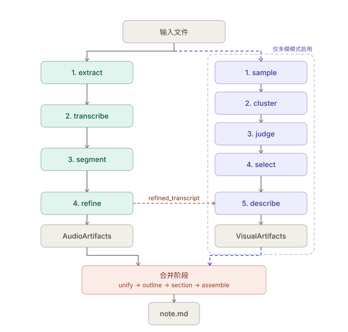

# LongVideo-Notes

从长视频/音频生成结构化文字笔记的本地工具。面向网课、讲座、播客、板书课等长形式教学内容,自用,CLI 优先,**架构稳健且可演进**。

---

## 1. 项目目标

把一段 1-3 小时的视频或音频转成一份高质量、结构化、可读的 Markdown 笔记。

设计原则上有三条硬约束:

1. **质量优先于速度**。可以慢、可以贵,但产出的笔记要真的能替代手记,不是逐字稿堆砌。
2. **稳健、可断点续跑**。任何阶段挂掉,下次重跑只跑挂掉之后的。中间产物全落盘,可单独检查、可单独重跑。
3. **本地工具,不做产品**。CLI、单进程、文件系统存储。不做 Web UI、不做数据库、不做任务队列、不做用户系统。

非目标(明确不做):

- 实时处理(直播转笔记之类)
- 多说话人区分
- 在线协作 / 笔记同步
- 移动端
- 视频平台的下载器(B 站、YouTube 等)。输入只接受本地媒体文件或本地目录
- 笔记导出格式扩展(PDF / Word / Notion)。输出仅 Markdown
- 笔记问答 / RAG / 向量索引
- **多语种通用性**。第一版仅在中文输入上验证,prompt 模板写死中文。英文 / 日文输入可能可用但不保证质量,后续再参数化

---

## 2. 支持的功能

### 2.1 输入

- 本地视频文件:`.mp4`, `.mkv`, `.webm`, `.mov` 等 ffmpeg 支持的格式
- 本地音频文件:`.mp3`, `.wav`, `.m4a`, `.flac` 等
- 本地目录:递归扫描目录下支持的媒体文件,跳过隐藏路径和已生成的 `*.head-<minutes>m.*` 裁剪文件
- 输入路径通过 CLI 参数提供,可以是单个媒体文件或目录

### 2.2 处理模式

- **纯音频模式**:默认模式。只走音频管线,产出基于讲解内容的笔记。适用于音频文件、或视频但不需要画面信息的场景。
- **多模模式**:显式传 `--mm` 时启用。音频管线 + 多模管线并行,画面和讲解联合生成笔记。适用于含 PPT / 板书 / 代码演示的教学视频。

模式只由 CLI 参数决定。输入是音频文件时强制纯音频模式;输入是视频文件时默认纯音频模式,显式传 `--mm` 才启用多模。目录输入逐个媒体文件独立判定模式;目录输入加 `--mm` 时,视频文件走多模,音频文件自动走纯音频。配置文件只提供各 stage 的参数,不提供额外的音频/多模启停开关,避免 `--mm` 与配置形成双源事实。

### 2.3 输出

- Markdown 笔记：单文件输入时 latest 文件和带时间戳归档写在 `output_dir/` 下；目录输入时在 `output_dir/` 下保留输入目录内的相对目录结构，含:
  - 自动生成的章节结构
  - 每章正文(清洗后的讲解内容 + 视觉内容描述)
  - 关键画面截图(多模模式下)
  - 时间戳标注(可选 `?t=` 跳转格式)
  - 章节内交叉引用:前文讲过的概念在后文出现时自动渲染为指向首次出现位置的链接
- 完整的中间产物缓存目录,用于调试和重跑

### 2.4 LLM 与 ASR 后端

- **LLM**:通过统一的 provider 抽象层,第一版实现 `openai_chat`、`openai_responses`、`anthropic_messages`、`openai_compatible_chat`。其中 `openai_compatible_chat` 覆盖 OpenAI、OpenRouter、本地 vLLM、各类反代、DeepSeek、Qwen 等 Chat Completions 兼容 endpoint。配置文件中可为不同任务(切分、整理、视觉判断、视觉描述、大纲、分章)配置不同的 profile。
- **ASR**:默认本地 faster-whisper(支持 GPU 批量推理)。抽象接口预留,将来可加 OpenAI / Groq / 国内厂商的 Whisper API 实现。

---

## 3. 整体流程

两条管线 + 一个合并阶段。两条管线大部分阶段并行,但**多模管线的最后一步(VLM 详细描述)依赖音频管线的 refined 产物**——画面理解需要结合该时段讲师的讲解文字。纯音频模式下只跑音频管线和合并阶段。



图中实线为必经路径(纯音频模式即可完成);紫色虚线框内为多模管线,仅在多模模式下启用,其入口与出口箭头都是虚线。橙色虚线 `refined_transcript` 表示跨管线依赖:多模管线的 describe stage 需要音频管线 stage 4 (refine) 的产物。

调度上的含义:

- 音频管线 stage 1-4 顺序执行
- 多模管线 describe 之前的 stage 顺序执行,**与音频管线并行**(互不依赖)
- 多模管线 describe 需要音频管线 stage 4(refine)的产物,因此:
  - 如果多模管线 `semantic_filter` 比音频管线 stage 1-4 快,`align` 和 `describe` 在音频管线完成后才能启动
  - 反之,音频管线完成时 `semantic_filter` 已经好了,`align` 和 `describe` 直接接上
- 合并阶段在两条管线全部完成后启动
- 纯音频模式下多模管线整体跳过,合并阶段直接消费 `AudioArtifacts`

### 3.1 音频管线(4 个 stage)

| Stage | 名称       | 工具           | 产物                                                       |
| ----- | ---------- | -------------- | ---------------------------------------------------------- |
| 1     | extract    | ffmpeg         | `audio.wav` (16kHz mono) + 元信息                          |
| 2     | transcribe | faster-whisper | `transcript_raw.json` (带 word-level 时间戳)               |
| 3     | segment    | LLM            | `segments.json` (语义切分点)                               |
| 4     | refine     | LLM            | `refined_transcript.json` (按段清洗 + 摘要 + 跨段术语呼应) |

Stage 3 是 LLM 一次性看全文输出切分点(短输出,避免长输出衰减)。Stage 4 默认使用 adaptive refine:先尝试一次生成完整 `RefinedTranscript`,失败后按 batch 生成,单个 batch 失败再退回逐段 serial。refine 会将 ASR 原文整理成带中文标点的书面表达,并识别跨段概念引用,以内部 marker `[[REF:N]]` 形式嵌入清洗文本;最终笔记由合并阶段据此渲染章节内交叉引用。

### 3.2 多模管线(4 个主 stage,仅多模模式启用)

| Stage | 名称     | 工具           | 产物                                                      |
| ----- | -------- | -------------- | --------------------------------------------------------- |
| 1     | filter   | PySceneDetect ContentDetector + OpenCV | `filter_frames/` + `filtered_sample.json` |
| 2     | semantic_filter | 弱 VLM | `semantic_frames/` + `semantic_sample.json` + `semantic_judgements.json` |
| 3     | align    | 纯逻辑 + refined text segments | `alignments.json` |
| 4     | describe | 强 VLM + refined text，并发 | 每张 aligned semantic frame 的详细图文描述 |

Stage 1 用 PySceneDetect 检测 scene，并直接从每个 scene 中临时抽候选帧选择代表帧。Stage 2 用弱 VLM 删除讲者、黑屏、UI、空白和无笔记价值画面，并按 `semantic_key` 对同语义内容去重，只保留质量最高的代表帧。Stage 3 以 refined text segment 为权威边界,按图片 timestamp 对齐文本段；远离任何文本段的图片仍保留，但不向 describe 传递音频上下文。Stage 4 以图片为事实来源，OCR 优先，并发输出 `visible_text`、`visible_evidence` 和详细视觉描述。

### 3.3 合并阶段

| 步骤     | 工具       | 产物                                                  |
| -------- | ---------- | ----------------------------------------------------- |
| unify    | 纯逻辑     | `ContentBlock` 序列(按时间排序,含转录 + 可选视觉信息) |
| outline  | LLM        | 章节结构 (`outline.json`)                             |
| section  | LLM (并发) | 每章 Markdown (`sections/{chapter_id:03d}.md`),保留内部 marker |
| assemble | 纯逻辑     | 最终 latest Markdown 与带时间戳归档 Markdown,marker 替换为人类可读形态          |

`ContentBlock` 是统一抽象:纯音频模式下所有 block 没有视觉字段,多模模式下有视觉的 block 含画面+描述。下游 outline / section 不区分两种模式。

时间戳和跨段引用全程使用内部 marker `[[TS:<seconds>]]` / `[[REF:<id>]]` 在管线内传递,只在 assemble 阶段做最终人类可读渲染。

---

## 4. 模块结构

```
longvideo-notes/
├── pyproject.toml              (项目依赖与命令入口)
├── .importlinter                (依赖契约,CI 强制)
├── config.example.yaml           (完整配置示例)
├── README.md                    (项目入口与文档索引)

│
├── docs/
│   ├── core.md                  (core 框架层详细设计)
│   ├── media.md                 (ffmpeg / ffprobe 唯一入口详细设计)
│   ├── llm.md                   (LLM provider 详细设计)
│   ├── asr.md                   (ASR 抽象详细设计)
│   ├── cli.md                   (CLI 命令与调度详细设计)
│   ├── audio-pipeline.md        (音频管线详细设计)
│   ├── visual-pipeline.md       (多模管线详细设计)
│   ├── merge.md                 (合并阶段详细设计)
│   ├── coding-standards.md      (开发规范,所有模块必读)
│   ├── overview.md              (本文档)
│   └── assets/
│       └── longvideo_notes_pipeline.svg  (流程图)
│
├── lvnotes/
│   ├── __init__.py
│   ├── __main__.py              (模块入口)
│   │
│   ├── core/                    (框架层,被所有模块依赖)
│   │   ├── schemas/             (跨模块 dataclass 包)
│   │   │   ├── __init__.py      (re-export 全部)
│   │   │   ├── audio.py
│   │   │   ├── visual.py
│   │   │   └── merge.py
│   │   ├── artifacts.py         (AudioArtifacts / VisualArtifacts 访问接口)
│   │   ├── paths.py             (缓存路径常量)
│   │   ├── timestamps.py        (时间戳工具,全项目唯一来源)
│   │   ├── slugs.py             (slug / chapter anchor 唯一来源)
│   │   ├── pipeline.py          (Stage 抽象 + StageOutput)
│   │   ├── cache.py             (内容寻址缓存 + atomic_write_* + hash_prompt_template)
│   │   ├── serialization.py     (JSON 序列化 / 反序列化)
│   │   ├── config.py            (pydantic-settings 配置加载,含封闭任务名集合)
│   │   ├── context.py           (PipelineContext)
│   │   ├── parallel.py          (有界并发 helper)
│   │   ├── progress.py          (进度输出 helper)
│   │   ├── transcript.py        (转录文本按时间切片)
│   │   ├── exceptions.py
│   │   ├── constants.py
│   │   └── logging.py           (logger 配置)
│   │
│   ├── media/                   (ffmpeg 唯一入口)
│   │   ├── probe.py
│   │   ├── audio.py
│   │   ├── video.py
│   │   └── trim.py
│   │
│   ├── llm/                     (LLM provider 抽象,唯一入口)
│   │   ├── base.py
│   │   ├── types.py
│   │   ├── openai_chat.py
│   │   ├── openai_responses.py
│   │   ├── anthropic_messages.py
│   │   ├── openai_compatible_chat.py
│   │   ├── factory.py
│   │   ├── json_helper.py       (complete_json:LLM JSON 解析 + 1 次修复重试)
│   │   ├── text_helper.py       (complete_text + 限流重试入口)
│   │   ├── options.py           (reasoning / thinking 请求选项合并)
│   │   ├── rate_limit.py        (profile 级进程内限速)
│   │   └── budget.py            (token / 成本预估)
│   │
│   ├── asr/                     (语音转录抽象 + 实现)
│   │   ├── base.py
│   │   ├── faster_whisper_local.py
│   │   └── factory.py
│   │
│   ├── audio_pipeline/          (音频管线,4 个 stage)
│   │   ├── extract.py
│   │   ├── transcribe.py
│   │   ├── segment.py
│   │   ├── refine.py
│   │   └── prompts/
│   │       ├── segment.jinja
│   │       ├── refine.jinja
│   │       ├── refine_batch.jinja
│   │       └── refine_single.jinja
│   │
│   ├── visual_pipeline/         (多模管线)
│   │   ├── filter.py
│   │   ├── semantic_filter.py
│   │   ├── align.py
│   │   ├── describe.py
│   │   └── prompts/
│   │
│   ├── merge/                   (合并阶段)
│   │   ├── unify.py
│   │   ├── outline.py
│   │   ├── section.py
│   │   ├── assemble.py
│   │   └── prompts/
│   │
│   └── cli/
│       └── app.py               (typer/click 入口)
│
├── tests/
│   └── unit/
│
└── cache/                       (运行时产生,gitignore)
    └── {input_hash}/
        ├── audio/
        │   ├── audio.wav
        │   └── extract.json
        ├── visual/              (多模模式下)
        │   ├── filter_frames/
        │   ├── semantic_frames/
        │   ├── filtered_sample.json
        │   ├── semantic_sample.json
        │   ├── semantic_judgements.json
        │   ├── alignments.json
        │   └── descriptions.json
        ├── transcript_raw.json
        ├── segments.json
        ├── refined/
        │   └── {seg_id}.json
        ├── refined_transcript.json
        ├── content_blocks.json
        ├── outline.json
        ├── sections/
        │   └── {chapter_id:03d}.md
        └── note.md              (cache 副本;最终产物写入 output_dir 下的 latest Markdown 和带时间戳归档文件)
```

---

## 5. 各模块设计原则

### 5.1 `core/` —— 框架层

**职责**:提供所有其他模块共用的基础设施。包括数据 schema、缓存机制、配置加载、日志、路径常量、时间戳工具、slug 工具、原子写入工具。

详细契约见 `docs/core.md`。

**原则**:

- 不写业务。任何模块特定的逻辑都不应在 `core/` 出现。
- **所有跨模块共享的数据类型集中在 `core/schemas/`**,禁止在其他模块定义副本。
- **所有路径常量集中在 `core/paths.py`**,禁止在其他模块拼接缓存路径。
- **所有时间戳格式化/解析集中在 `core/timestamps.py`**。
- **所有 slug / anchor 生成集中在 `core/slugs.py`**。
- **所有原子文件写入集中在 `core/cache.py` 的 `atomic_write_*`**。

**接口契约**:

- 时间戳全项目使用 `float` 秒数,精度毫秒。仅在 CLI 输出和 Markdown 渲染时转换为 `mm:ss` / `hh:mm:ss`。
- 所有跨阶段产物的 schema 在此定义,stage 实现时只引用、不修改。
- Schema 字段只放"内容",不放配置元信息。配置元信息由 `StageOutput.metadata` 携带。

### 5.2 `media/` —— ffmpeg 唯一入口

**职责**:所有 ffmpeg / ffprobe 调用。

详细契约见 `docs/media.md`。

**原则**:

- 全项目唯一允许 `subprocess` 调用 ffmpeg 的地方。其他模块需要 ffmpeg 操作时调用 `media/` 提供的函数。
- 函数粒度细:抽 wav 是一个函数、抽帧是一个函数、读元数据是一个函数。不做"万能 ffmpeg 包装器"。

### 5.3 `llm/` —— LLM provider 抽象

**职责**:统一所有 LLM 调用,屏蔽不同协议(OpenAI Chat / Responses / Anthropic Messages)和不同 endpoint 的差异。

详细契约见 `docs/llm.md`。

**原则**:

- **全项目唯一允许 `import openai` / `import anthropic` 的地方**。其他模块通过 `get_client(config, profile_name)` 或 `for_task(config, task_name)` 获取统一接口的客户端。
- 实现按"协议"切,不按"服务商"切:
  - `OpenAIChatClient` 覆盖 OpenAI Chat 协议
  - `OpenAICompatibleChatClient` 覆盖 OpenAI、OpenRouter、本地 vLLM、DeepSeek、Qwen、各类反代等所有 OpenAI Chat 兼容 endpoint
  - `OpenAIResponsesClient` 给需要 Responses API 的模型
  - `AnthropicMessagesClient` 给 Anthropic Messages API
- 配置中通过 profile 区分 endpoint,profile 包含:provider、base_url、api_key 环境变量名、model、capabilities flags(vision / prompt_cache / json_mode / reasoning)、max_context、reasoning defaults。
- 任务 → profile 映射在配置中:`tasks.segment: gpt5_main`、`tasks.slide_judge: weak_vlm` 等。代码用 `for_task(config, "segment")` 获取,配置改 profile 不改代码。

**JSON 输出 helper**:`llm/json_helper.py` 提供 `complete_json(client, messages, schema, options, max_repair_retries=1)`,统一处理"LLM 输出 JSON 解析 + 1 次修复重试 + schema 校验"。需要记录原始 LLM 输出的 stage 使用 `complete_json_with_raw(...)`。业务不变量由 stage 校验;outline 对章节覆盖不变量失败会记录诊断文件并做 1 次修复重试。

典型调用:

```python
client = for_task(config, "segment")
segments = complete_json(client, messages, SegmentList, options)
```

**接口契约**:

- `LLMClient.complete(messages, options=None) -> LLMTextResult`
- `complete_text(client, messages, options) -> LLMTextResult`
- `complete_json(client, messages, schema, options, max_repair_retries=1) -> JsonSchemaT`
- `complete_json_with_raw(client, messages, schema, options, max_repair_retries=1) -> tuple[JsonSchemaT, LLMTextResult]`
- 错误归一化:所有实现统一抛 `AuthError` / `RateLimitError` / `ContextLengthError` / `TransportError`,调用方只 catch 这些。

### 5.4 `asr/` —— ASR 抽象

**职责**:语音转录的统一接口。

详细契约见 `docs/asr.md`。

**原则**:

- 输出统一的 `Transcript` dataclass(在 `core/schemas/audio.py` 定义),下游不感知具体后端。
- 第一版只实现 `faster_whisper_local`,含 batched 推理选项。
- 接口预留 API 后端(OpenAI / Groq)的实现位置,第一版不做。

### 5.5 `audio_pipeline/` —— 音频管线

**职责**:实现音频处理的 4 个 stage(extract / transcribe / segment / refine)。

**原则**:

- 每个 stage 一个文件。每个文件暴露一个主函数 `run(ctx) -> StageOutput`。
- Stage 的输入输出全部用 `core/schemas/` 中定义的 dataclass。
- LLM 调用走 `llm/`,ffmpeg 调用走 `media/`,ASR 调用走 `asr/`。本模块不直接 import 任何第三方 SDK。
- Prompt 模板放在 `prompts/` 子目录,用 Jinja2,跟代码分离。
- **不引用 `visual_pipeline/` 或 `merge/`**。本模块完全独立。

**对外接口**:通过 `core/artifacts.py` 的 `AudioArtifacts` 类对外提供产物访问。其他模块(多模管线、合并阶段)只通过这个接口读音频产物,不直接读文件、不直接 import `audio_pipeline`。

### 5.6 `visual_pipeline/` —— 多模管线

**职责**:实现多模处理的主链路 stage(filter / semantic_filter / align / describe)。

**原则**:

- 同 `audio_pipeline/` 的原则。
- 通过 `AudioArtifacts` 接口读音频管线的产物(`align` 与 `describe` 需要)。
- **不引用 `audio_pipeline/` 内部模块**,只用 `AudioArtifacts`。
- 所有 stage 均通过统一 `run(ctx) -> StageOutput` 接口执行。

**对外接口**:`VisualArtifacts` 类,跟 `AudioArtifacts` 对称。

**字段命名约定**:视觉相关 schema 使用 `frame_id` 表示 filter 输出 frame namespace 中的帧编号,使用 `image_source_path` 表示相对当前视觉产物帧目录的图片源路径。`filtered_sample.json` 相对 `filter_frames/`;`semantic_sample.json`、`alignments.json`、`descriptions.json` 相对 `semantic_frames/`。`VisualAlignment.has_audio_context` 只控制 describe 是否可使用对应音频文本；`VisualDescription.visible_text` 和 `visible_evidence` 是调试 OCR 忠实度的结构化产物。最终 Markdown 路径由 `core.paths.make_markdown_image_path()` 生成。全局 `source_path` 只表示解析后的绝对本地输入音频/视频路径。

### 5.7 `merge/` —— 合并与笔记生成

**职责**:把音频和(可选的)多模产物合并为 `ContentBlock` 序列,调用 LLM 生成大纲、分章生成、组装最终笔记。

**原则**:

- 通过 `AudioArtifacts` / `VisualArtifacts` 读上游产物,不直接读文件。
- 同样不直接 import 上游管线模块。
- `unify.py` 处理两种模式(纯音频 / 多模)的合并逻辑;outline / section 消费统一的 `ContentBlock` 序列;assemble 只把本次 `mode` 写入 frontmatter 并纳入 assemble cache key。
- 时间戳与跨段引用全程使用内部 marker(`[[TS:...]]` / `[[REF:...]]`),只在 `assemble.py` 做最终人类可读替换。

### 5.8 `cli/` —— 入口

**职责**:CLI 命令解析、调度两条管线、错误处理、进度显示。

详细契约见 `docs/cli.md`。

**原则**:

- 用 typer 或 click,子命令风格:`lvnotes run`、`lvnotes inspect`、以及顶层 stage 命令(如 `lvnotes extract <input-path>`、`lvnotes transcribe <input-path>`、`lvnotes outline <input-path>`、`lvnotes assemble <input-path>`)。
- 调度结构按双管线设计。调度层可以并发执行音频管线和多模管线,但每个 stage 对外仍固定暴露同步 `run(ctx) -> StageOutput` 接口;多模管线 disabled 时直接跳过。
- refine stage 的开发期审核能力通过 CLI 参数暴露,如 `lvnotes refine --debug`;该开关不进入配置文件。
- 不在 CLI 写业务逻辑。CLI 只负责"解析参数 → 配置 Pipeline → 启动 → 处理输出"。

---

## 6. 关键架构约定

这几条是项目的"宪法",所有模块必须遵守。`coding-standards.md` 会把它们落到具体的 do/don't。

1. **单向数据流**。下游模块不回头读上游的"上一阶段"产物。比如 `merge/` 只读 `AudioArtifacts.get_refined()`,不读 `transcript_raw.json`。
2. **所有阶段产物落 JSON / 文本文件,不用 pickle**。手工可读、可改、可单独重跑。所有跨模块产物文件的写入必须经 `core/cache.py` 的 `atomic_write_*` 唯一入口,避免进程中断留下半文件。
3. **缓存按"内容 hash + 配置 hash + stage 名"自动失效**。改 prompt、改模型、改阈值会自动让对应 stage 缓存失效,无需手动 invalidate。Prompt 模板的 hash 经 `hash_prompt_template` 做最小归一化(去 Jinja 注释 + collapse 空白),避免格式化无关变更触发重跑。
4. **跨模块数据用 dataclass / pydantic 模型,禁用 `dict[str, Any]`**。Schema 字段只放内容,不放配置元信息。
5. **唯一入口规则**:ffmpeg 经 `media/`,LLM 经 `llm/`,ASR 经 `asr/`,缓存路径经 `core/paths.py`,时间戳经 `core/timestamps.py`,slug / anchor 经 `core/slugs.py`,跨模块产物访问经 `core/artifacts.py`,**原子写入与模板 hash 经 `core/cache.py`**。其他模块不绕开这些入口。
6. **音频管线和多模管线相互不可见**。两者通过 `core/` 的 `AudioArtifacts` / `VisualArtifacts` 解耦。
7. **配置即数据**。所有阈值、模型名、超时、prompt 路径、profile 名通过配置文件传入,代码中不出现魔法数字。
8. **没有数据库、没有任务队列、没有 Web 服务器**。文件系统 + 单进程足够。
9. **管线内部用 marker,人类形态在 assemble**。时间戳跳转、跨段引用链接,都用内部 marker(`[[TS:...]]` / `[[REF:...]]`)在 LLM 输出与中间产物中传递,assemble 阶段做唯一一次人类可读替换。LLM 不直接生成最终链接 URL。

---

## 7. 实现与验收

当前实现按以下模块边界组织,每个 stage 应保持可单独执行和可独立验收。

1. **基础设施**:`core/`(schemas、paths、timestamps、slugs、pipeline、cache、config、logging、context)+ `media/probe.py` + `media/audio.py` + `media/trim.py` + `cli/app.py` + `.importlinter` 契约。
2. **LLM 抽象**:`llm/`(base、types、openai_chat、openai_responses、anthropic_messages、openai_compatible_chat、json_helper、factory)。
3. **ASR 抽象**:`asr/`(base、faster_whisper_local、factory)。
4. **音频管线**:按 stage 顺序 extract → transcribe → segment → refine。
5. **合并阶段**:`merge/unify.py` + `outline` + `section` + `assemble`,支持纯音频和多模输入。
6. **多模管线**:filter → semantic_filter → align → describe。
7. **测试与打磨**:用真实音频/视频跑全流程,调 prompt、调阈值、修 bug。

每一步完成的"验收标准"是:

- 该 stage 单独可通过 CLI 调用
- 缓存命中正常
- 至少一个真实输入跑通端到端
- 单元测试覆盖主路径和错误路径

---

## 8. 配置文件示例

完整配置示例见 `config.example.yaml`,当前这里只给框架。

`tasks.*` 是封闭任务名映射。第一版任务名为 `segment` / `refine` / `outline` / `section` / `slide_judge` / `slide_describe`。新增任务名必须先更新配置 schema,运行时配置含未知任务名直接 `ConfigError` 退出。

```yaml
project:
  cache_dir: ./cache
  output_dir: ./output # 最终 latest 与带时间戳归档笔记写入这里;cache 内 note.md 作为可复查的中间产物

llm:
  profiles:
    gpt5_main:
      provider: openai_chat
      base_url: https://api.openai.com/v1
      api_key_env: OPENAI_API_KEY
      model: gpt-5
      capabilities: [vision, prompt_cache, json_mode, reasoning]
      max_context: 1000000
      reasoning_effort: medium
    weak_vlm:
      provider: openai_compatible_chat
      base_url: https://openrouter.ai/api/v1
      api_key_env: OPENROUTER_API_KEY
      model: google/gemini-2.5-flash
      capabilities: [vision]

tasks:
  segment: gpt5_main
  refine: gpt5_main
  outline: gpt5_main
  section: gpt5_main
  slide_judge: weak_vlm # 多模管线用
  slide_describe: gpt5_main # 多模管线用

asr:
  backend: faster_whisper_local
  model: large-v3
  device: auto
  compute_type: auto
  use_batched: true
  batch_size: 16
  vad: true
  language: zh

audio_pipeline:
  extract:
    sample_rate: 16000 # 重采样目标,可选 8000/16000/22050/32000/44100/48000
    channels: 1 # 重采样目标,1 (mono) 或 2 (stereo)
  segment: {}
  refine:
    mode: adaptive
    batch_size: 8

visual_pipeline:
  filter:
    detector: content
    threshold: auto
    auto_threshold_candidates: [10.0, 15.0, 20.0, 25.0, 27.0, 30.0, 35.0, 40.0]
    target_frames_per_minute: 1.5
    min_scene_len_seconds: 1.0
    representative: content
    candidate_fps: 3.0
    min_content_score: 0.5
    duplicate_pixel_mean_threshold: 0.025
  align:
    max_context_gap_seconds: 3.0
  describe:
    concurrent_calls: 5

merge:
  outline:
    target_chapter_count_hint: "5-12"
  section:
    concurrent_calls: 5
    # LLM 输出走内部 marker [[TS:seconds]],由 assemble 替换
  assemble:
    timestamp_format: "[{hms}]" # 时间戳渲染形态;支持 {hms} {mmss} {seconds} {seconds_int}
    include_toc: true # 顶部目录
    include_metadata: true # YAML frontmatter(输入路径、时长、模式等)
    video_url_template: null # 默认时间戳为纯文本;配置后渲染为跳转链接
    # 例: "file://{source_path}?t={seconds_int}"
    top_title: null # null 时从输入文件名派生
```

---

## 9. 依赖

运行时依赖与 dev 依赖以 `pyproject.toml` 为准。多模 filter 阶段使用 PySceneDetect 做 scene detection，并用 OpenCV 从原视频读取候选帧。

系统层面需要 `ffmpeg` / `ffprobe`。

---

## 10. 文档索引

- `docs/cli.md` —— CLI 权威:命令、模式规则、调度与缓存控制详细设计。
- `docs/llm.md` —— LLM 权威:provider 抽象、profile、JSON helper、错误归一化详细设计。
- `docs/core.md` + `docs/coding-standards.md` —— 架构/实现约束权威:schema、artifacts、paths、cache、config、context、模块边界与开发规范。
- `docs/media.md` —— media 模块权威:ffmpeg / ffprobe 唯一入口详细设计。
- `docs/asr.md` —— ASR 模块权威:ASR 抽象与 faster-whisper 本地实现详细设计。
- `docs/audio-pipeline.md` —— 音频管线权威:4 个 stage 的详细设计与接口契约。
- `docs/visual-pipeline.md` —— 多模管线权威:filter / semantic_filter / align / describe。
- `docs/merge.md` —— 合并阶段权威:最终 Markdown 生成与用户产物契约。

每份管线文档都按以下结构组织:Overview、Design Considerations(设计要点)、Stages(含每个 stage 的 input/output schema、实现要点、配置项、缓存规则、错误处理)、Schema、Downstream Interfaces、Module Layout、Dependencies、Implementation Order。
